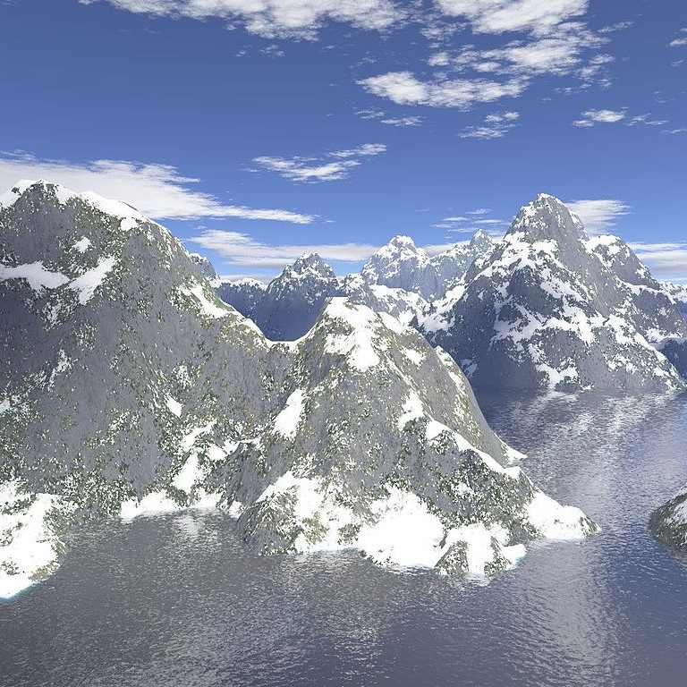
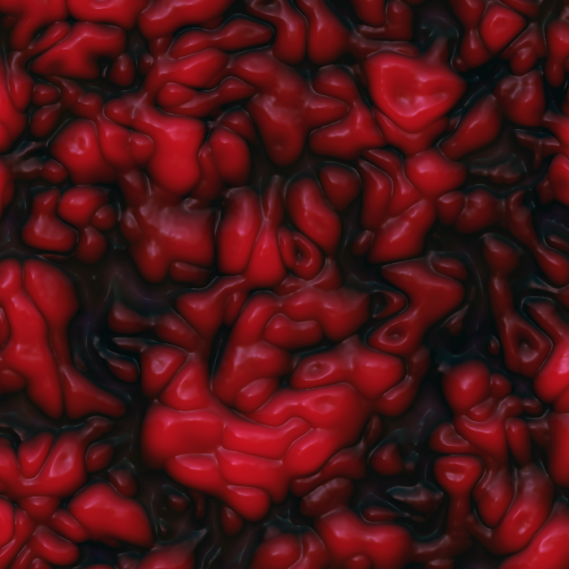

# Terrain Lab

# Introduction

Hello, welcome to the Terrain Lab! This module introduces you to the concept of procedural noise, interpolation functions, and how they can be used to create visually rich environments with very little manual work! We will be implementing a noise generation function and use it to create a mountainous terrain height map. Then we will have a quick exercise in vector operations to create visually interesting snow effects. Let's get started!

By the end of this lab you should be able to…

identify the merits of procedural noise,
understand how scaling and adding noise creates interesting detail,
be able to come up with your own creative uses for procedural noise!
working with non-Implicit Geometry and per vertex information.

# Noise Generator

## Context
Procedural noise as a concept in graphics is simply any method that can create randomized data with certain desirable properties (like continuity for example).

| Procedural Mountains  | Perlin Flow | Procedural Organic Texture|
| --------------------- | ------------- | ------------------------- |
|  |  |  |

As you can see from these examples, well constructed noise can be used to create really incredible scenes and images from completely random data!
	
The noise that we will be implementing today is called Perlin Noise, and is a classic noise generation algorithm. Let's hop into it.

 
 Why Perlin Noise?
 
	

 

## Implementation

The method of creating perlin noise is, generally, as follows…
define a grid of vectors with randomized direction
for a given interest point, find the four closest grid points and compute an offset vector from grid point to the interest point.
compute a dot product between each offset and its randomized vector
use an interpolation function to combine the 4 dot products into a single value.
Repeat for each location you want to evaluate!

Don't worry if you are still confused, this is just a high level overview. We will get into the details in the later Tasks!

> **Task 1:** Obtain four closest grid points

(image showing task)

Given the floating point coordinates to evaluate we need to compute the integer indices of the four closest grid points. Look into glm::floor and glm::ceil.

> **Task 2:** Compute the four offset vectors

(image showing task)

Using the coordinates of the four closest grid points and the input location, compute the four offset vectors from the grid points to the interest point. Make sure to normalize the results to unit vectors.

> **Task 3:** Compute dot product between offset and random vector

(image showing task)

We have four offset vectors and can look up the random vectors for each using getGridVector. Now compute the dot product between the corresponding offset vectors and random grid vectors. This will yield four floating point values, one for each grid point, that we will combine to get the final height.

Fill in the function, interpolate, in the stencil.

Introduction to Interpolation

We are now faced with an important decision: Choice of interpolation function. There is no "right" or "correct" interpolation method in general, only what effect you want to create for a specific application.

The problem can be stated abstractly as follows…

Given two different values (A and B) and a mix parameter (represented by the horizontal axis) between 0 and 1, how can we determine an output as a combination of these three values. Subject to the constraint that when the mix parameter equals 0 or one we want to output A or B respectively. We can visualize this in the following image…

(add images showing terrain with no interpolation)

The question becomes visually, how do we want to draw a line connecting A to B? Consider a linear interpolation. Given by y = A + x (B - A)

	

(add images showing terrain with linear interpolation)

 
This creates an even transition between the two values, which may be interesting depending on the application.

We could also consider This weird function below…

(add images showing terrain with wacky interpolation)

…if you really wanted to. The point is that this is more of a creative design decision than an analytically correct one.

We recommend using bicubic interpolation, given by the formula $y = A + (3x^{2}-2x^{3}) * (B - A)$, as it yields smooth results but feel free to try out your own interpolation function and show us any cool results!

(add images showing terrain with bicubic interpolation)

> **Task 4:** Fill in interpolation function

Now that we have all our data, we need to combine it into one value representing the noise value at this coordinate. This is where we put our interpolation function to work. 

We have a problem though, we defined our interpolation to work based on two values and one mix parameter, so how are we going to combine 4 different values?

The answer is to perform multiple interpolations and then compose them to get one final value.

(image with 4 point interpolation)

Suppose we have the four values A, B, C, and D at their corresponding grid points.
get G by interpolating between A and B 
get H by interpolating between C and D
get Result by interpolating between G and H

Note here that the interpolation factor for all these calculations is given by distance(interpolation point, first reference)/distance(first reference, second reference).

Now that has all been covered, finish writing the generatePerlin function by writing this four way interpolation!

> **Task 5:** Using your interpolation function to merge four values into one

# Introducing Octaves

Now that we have simple, bumpy terrain, we are going to add some visual detail by adding multiple copies of noise with different scales. This will replace the smooth unnatural hills with rugged mountains!

(get pictures showing the result)

## Scaling our Perlin Noise

The first thing to understand is how to scale the noise in the first place. Remember how we are generating the height in the first place, a call to (name of function here) with x and y used directly.

> **Task 6:** Modify just the inputs to `computePerlin` and generate noise with a different scale.

## What are Octaves

Now that we know how to scale the noise the question is how much? Well we could pick any arbitrary amount to be honest. However, one technique which gives natural looking results is to increase the frequency by powers of two. By doubling the frequency we get the next "octave" of the noise (to people with some knowledge of music this may be familiar).

But we have to be careful when doing this. If we just directly add the higher frequency noise without changing it, the higher frequencies will overpower the lower frequency information. To protect against this, as we double the frequency of the noise, we halve the amplitude. This keeps a hierarchy to the noise that gives a really good effect.

> **Task 7:** In the (compute height function) use multiple calls to the generate noise function to add at least 4 different noise octaves to the scene each with the correct amplitude and frequency to generate rugged terrain!

# Hit the Slopes

Now that the height map has been specified we have some mountainous terrain but there is no color variation leading to a somewhat bland scene. To add some visual interest we are going to introduce a per-vertex color based on the slope of the surrounding terrain. The end goal is that mountain slopes are gray stone and flat areas or peaks are white like snow.

## Getting the Normal

The first thing we need to do is compute the normal for a given vertex.

Start by considering a vertex $V$ surrounded by its eight neighbors $n_0$ through $n_7$. Begin by grouping the vertices in triangles such that all triangles have a corner in $V$,
this creates triangles of the following form $(V, n_i, n_{i+1})$.

Now we need to calculate the normals for each triangle individually, and then average them together to get our final normal for $V$.
To compute the normal for triangle $(V, n_i, n_{i+1})$, Take the cross product (math equation here) and then normalize the result.

> **Task 8:** In the getNormal function use getPosition and compute the normal for the specified vertex.

## Setting the Color

Now that we have the normal, we need to use this slope information to make vertical sections gray and horizontal sections white.

To do this we are going to use our old friend, Interpolation! The first step is to get the mix factor. To do this take a dot product with the normal and a vector pointing directly up. The result will range from 1.0 when the slope is exactly horizontal to 0.0 when the slope is exactly vertical. We then use this value to interpolate between gray and white!

> **Task 9:** Fill in Compute Color. Use a dot product with a vertical unit vector to interpolate between gray and white.
